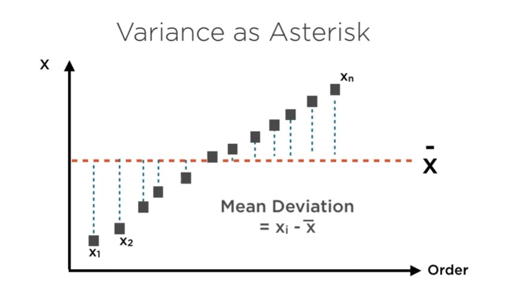
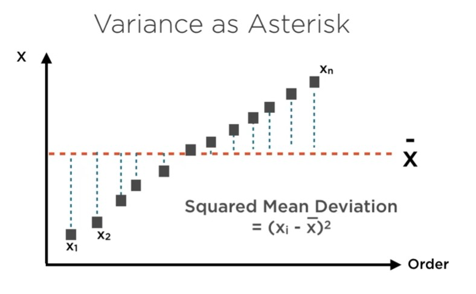
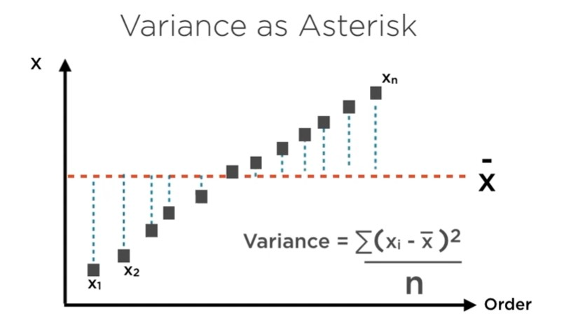
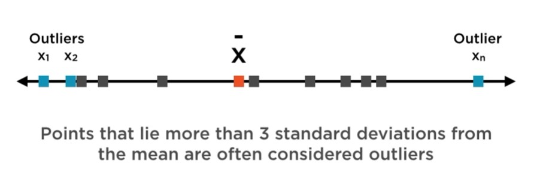

### Analytics

Descriptive Statistics (Find the dots)
* Identify important elements
* Missing values
    * Delete records
        * significantly reduce size 
        * introduce significant bias
    * Imputation
        * average
        * interpolate from nearby values
        * predict missing values
        * method:
            * hot-deck ( last observation carried forward )
            * mean substitution (weaking correlation)
            * fit model to predict missing column 
    
    * Outliers
        * differ significantly from other data points 
        * method:
            * identify outliers (univariate)
                * distance from mean 
                  * ```\bar{x} = \frac{X_1 + X_2 + ... + X_n}{n}```
                  * describing univariate data
                    * variation 
                        * range = Xmax - Xmin (describe dispersion in data)
                    * variance (to summarize set of data points )
                    
                      
                      
                    * variance Bessel's correction ( improve our estimate of variance by -1 denominator) 
                    
                    * standard deviation (Square root of variance)  
                    
                * distance from fitted line (points are far away from fitted line can be considered outliers)
                    * outliers may be the data points that do not fit into same relationship the rest of the data 
            * coping with outliers
                * drop outliers - error in measurement
                * cap/floor maximum or minimum
                * set outlier to mean
                * method:
                    * erroneous observation
                    * scrutinizing outliers 
                    * standardize data (easy to determine outliers with z score)
                        * subtract mean the data points and divide std 
                        * ~ 0 mean and ~ 1 std
Inferential Statistics (Connect the dots)
* Explain those elements via relationships
    1. Processing data for use
    2. Build and refine models for ml , prediction
    3. Incorporate real world data into models 
---

### Data Cleansing

* Remove duplicates -> Data Tab
* Remove blank -> Home -> Filter 
* Highlight blank -> Home -> Find & Select -> Go to Special -> Blank
    * Fill blank -> Ctrl + Enter
* Identify outliers
    * zscore : (x - xbar)/std 
    * anything greather than 3 or lower than -3 std is outliers 

### Excel
```
1. mean : avg
2. standard deviation : stdev
3. zscore : standardize(<col>,mean,std) 
            STANDARDIZE(C2,$U$21,$U$22)
4. 2 method :
    set outlier not greater than 3 or less than 3
    * filter zscore
    IF(OR(D2<$N$23,D2>$O$23),"",D2)
    * clamped zscore
    IF(F2<$N$23,$N$23,IF(F2>$O$23,$O$23,F2))
```

### References

1. https://www.codecogs.com/latex/eqneditor.php
2. http://mathurl.com/

---

### Python

### Missing values

* create na
    * np.nan
* how many na in single dataframe
    * df.isnull().sum()
* remove na   
    * df.dropna()
* fill na
    * df.fillna(value)
    * df.fillna(method='bfill')
    * df.fillna(method='ffill')
    * df.fillna(df[col].mean())
    * df.interpolate()
    
### Cleaning values

* remove columns
    * df.drop(<column name>, axis = 1)
    
* statistic overview
    * df.describe()
* rename column
    * df.rename(columns = {'<old>':'<new>'}, {'<old>':'<new>'})
* check any duplicate rows
    * df.duplicated()
* drop duplicate rows
    * df.drop_duplicates()
* check how many columns has na
    * df.isnull().sum()
    * df.isna().sum()
* see unique value
    * df.unique()
* drop multiple columns
    * df.drop(['column','column'],axis=1)
    

### slicing

* slicing dataframe
    * df[[col,col]]

### Export 

* to csv
    * df.to_csv('_.csv',index=False)
    
### Boxplot 

* one column
```
fig, ax = plt.subplots(figsize=(10,8))

sns.boxplot(
    numeric_data['mobile_wt'],
    orient='v'
)
```

* multiple column
```
fig, ax = plt.subplots(figsize=(10,8))

bp = sns.boxplot(data=numeric_data)
bp.set_xticklabels(bp.get_xticklabels(),rotation=90)
```

* remove outliers 
```
outliers_removed_data = numeric_data[~((numeric_data < (Q1 - 1.5 * IQR)) \
    | (numeric_data > (Q3 + 1.5 * IQR))).any(axis=1)]
```

* index
    * reset index
    ```
  scaled_data = scaled_data.reset_index()
    ```

* combine dataframe 
    * pd.concat
    ```
    scaled_data = scaled_data.reset_index()
    categorical_data = categorical_data.reset_index()
    pd.concat(
        [scaled_data,categorical_data], axis=1
    )
    ```

* ml : classification model 

```
from sklearn.model_selection import train_test_split
from sklearn.linear_model import LogisticRegression

X_train, X_test, y_train, y_test = train_test_split(
    X,y,
    test_size=0.2,
    random_state=101
)

logistic_model = LogisticRegression(
    solver='lbfgs',
    multi_class='multinomial', # categorize more than 2 categories
    max_iter=1000
)

logistic_model.fit(X_train,y_train)
logistic_model.score(X_test, y_test)
```

---

# Extract Insight 

1. Standardization and normalization
   * normalizing row wise
   * standardization column wise
   * scaling column wise     
2. Binning and sampling
3. Big data
4. Batch data vs  Streaming data
    a. Event time
    b. Processing time
## Pre processing   
### Standardizing Data
* for numeric features
* standardized data has mean 0 and variance 1 
```
xi - avg(x) / stdev(x)
```
* feature wise (column wise)
```
z = xi - mean(x) / stdev(x)
```
* mean is a measure of central tendency , standard deviation is a measure of dispersion
* mean is sensitive to outlier , more **robust standardization** use
    ```
    z = xi - median(x) / inter-quartile range(x)
    ```
    * median is a measure of central tendency
    * inter-quartile range is a measure of dispersion

### Normalization Data
* process of scaling input vectors individually to unit norm(unit magnitude), to simplify cosine similarity calculations
* applied to data feed into ml
* cosine similarity
    * measure of similarity between 2 non zero vectors , widely used in ml
* orthogonal vectors ( right angle , indepedent)
    * orthogonal vectors represent uncorrelated data 
    * cosine of 90 deg = 0
* cosine of 0 deg = 1 ( parallel , correlation equal 1 )    
* cosine of 180 deg = -1 (opposite, correlation equal -1)
* cosine similarity
    ```    
    cos(0) = A.B / ||A|| ||B||
    ||A||2 = XA2 + YA2 + ZA2
    ||B||2 = XB2 + YB2 + ZB2
     A.B = XAXB + YAYB + ZAZB
    ```
* Pre convert A and B unit norm vectors to simplify calculation
```
a = A / ||A|| = (xA,yA,zA)/ sqrt(xA2 + yA2 + zA2)

b = B / ||B|| = (xB,yB,zB)/sqrt(xB2 + yB2 + zB2)
```

* Different norms 
    * Normalization is general technique of convert a vector to unit norm
    * 3 different norms for vector
        * L1 , sum of absolute values of components of vector is equal to 1
        * L2 , square root of the sum of square of the vector coordinates is equal to 1
        * max norm, largest absolute value of elements of vector is set to 1
